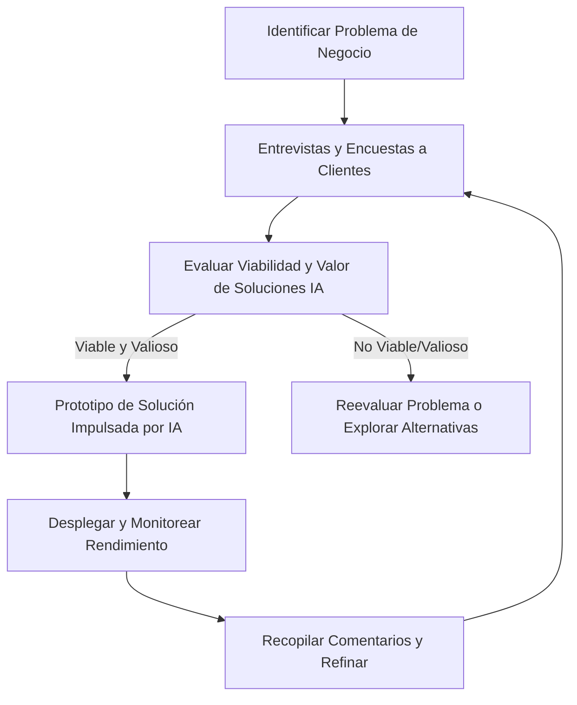

En el acelerado campo del Machine Learning (ML), la IA Generativa (GenAI) y la Generación Aumentada por Recuperación (RAG), puede ser tentador saltar directamente a modelos sofisticados o herramientas de vanguardia. Sin embargo, el primer paso más crítico a menudo se pasa por alto: **definir claramente el problema de negocio que intentas resolver.** Al adoptar un enfoque centrado en el problema, te aseguras de que tus iniciativas de IA aborden necesidades genuinas, se alineen con las expectativas de los clientes y entreguen valor medible. En este artículo, descubrirás cómo identificar tareas que se benefician de la automatización o el aumento, evaluar la viabilidad y el impacto comercial, y finalmente implementar soluciones de IA que impulsen el rendimiento de tu organización.

## Por qué Importa el Pensamiento Centrado en el Problema

Muchas organizaciones se interesan por las posibilidades del ML, GenAI y RAG, pero adoptan erróneamente estas tecnologías simplemente para "mantenerse a la vanguardia". La IA **nunca** debe ser sobre el hype; debe ser sobre resolver desafíos reales y entregar resultados tangibles.

- **Identifica Puntos de Dolor del Mundo Real:** Enfócate en los problemas específicos que socavan tu rendimiento o la experiencia del cliente.  
- **Valida las Necesidades del Cliente:** Asegúrate de que tu solución propuesta se alinee con las prioridades de aquellos a quienes sirves.  
- **Evalúa Viabilidad y Valor:** Mira de manera integral la preparación técnica, el potencial de ROI y los beneficios posteriores antes de asignar recursos sustanciales.

:::important[Pregúntate]
*"¿Cuál es el desafío exacto que estoy tratando de resolver, y la IA realmente agrega valor aquí?"* Si no puedes articular el problema en una sola oración a un interesado no técnico, probablemente no estés listo para una solución de IA todavía.
:::

---

## Definiendo la Oportunidad: Automatiza Tareas, No Trabajos

A pesar de las preocupaciones sobre que la IA reemplace roles completos, la realidad está en gra parte alejada de esto. **La IA es particularmente efectiva en automatizar o aumentar tareas discretas**, liberando a los trabajadores humanos para enfocarse en la creatividad, el pensamiento estratégico o la construcción de relaciones.

1. **Automatización de Tareas:** Ideal para actividades repetitivas basadas en reglas (por ejemplo, clasificar consultas por correo electrónico o generar informes de ventas semanales).  
2. **Aumento de Tareas:** Adecuado para tareas complejas que se benefician del soporte impulsado por IA (por ejemplo, usar IA para ayudar en la generación de contenido o en tareas complejas de soporte al cliente).

:::note[Pregúntate]
*¿Qué tareas rutinarias consumen la mayor parte del tiempo de tus empleados, y cómo podrías reasignarlos a trabajo de mayor valor con asistencia de IA?*
:::

---

## Evaluando la Idoneidad y la Utilidad de la IA: Viabilidad Técnica y Valor Comercial

Decidir qué tareas merecen automatización o aumento requiere equilibrar la **viabilidad técnica** (TF) con el **valor comercial** (BV). Considera:

1. **Viabilidad Técnica (TF)**  
      - Disponibilidad y calidad de datos  
      - Complejidad del modelo  
      - Preparación de la infraestructura  

   $$
   TF = f(\text{calidad de datos}, \text{complejidad del modelo}, \text{capacidad de infraestructura})
   $$

2. **Valor Comercial (BV)**  
      - Ahorros potenciales de costos  
      - Mejora del tiempo de comercialización  
      - Satisfacción mejorada del cliente  

   $$
   BV = f(\text{reducción de costos}, \text{eficiencia operacional}, \text{satisfacción del usuario})
   $$

Combina estos factores para priorizar iniciativas de alto impacto:

$$
\text{Score}(i) = \alpha \cdot TF(i) + \beta \cdot BV(i)
$$

donde $\alpha$ y $\beta$ reflejan tu ponderación estratégica de viabilidad versus valor.

---

## Involucrando a los Clientes para el Descubrimiento de Problemas

Involucra a tus clientes (y usuarios finales) temprano y a menudo para confirmar que los puntos de dolor que has identificado son reales y urgentes.  

- **Realiza Entrevistas y Encuestas:** Recopila comentarios directos sobre sus mayores frustraciones y mejoras deseadas.  
- **Prototipo y Demo:** Prueba conceptos impulsados por IA con un pequeño subconjunto de usuarios para validar la efectividad.  
- **Itera Basándote en Comentarios:** Refina continuamente tu enfoque en respuesta a los datos de uso del mundo real.

:::note[Pregúntate]
*¿Con qué frecuencia preguntas directamente a los clientes qué mejoras desean, en lugar de adivinar o confiar en suposiciones internas?*
:::

:::tip[Pro Tip]
Mantén un ciclo de retroalimentación continuo, integrando conocimientos de usuario en cada etapa para asegurar que tus soluciones de IA permanezcan alineadas con las expectativas cambiantes de los clientes.
:::

---

## Pasos Prácticos para la Integración de IA  

A continuación, un enfoque refinado paso a paso para incorporar GenAI, RAG o técnicas más amplias de ML en tu empresa. Estas pautas cubren los aspectos técnicos del diseño y despliegue de soluciones de IA y enfatizan la importancia de **evaluaciones** y una estrategia de **data flywheel** para mejorar continuamente tus modelos usando datos generados por usuarios.

---

### 1. Mapea los Flujos de Trabajo Actuales

1. **Diagrama de Procesos Existentes**  
   Identifica dónde existen tareas repetitivas, cuellos de botella de información o problemas de latencia. Estos puntos débiles son candidatos principales para la optimización impulsada por IA.

2. **Identifica Áreas de Alto Impacto**  
   Prioriza tareas basándote en tus objetivos comerciales específicos (por ejemplo, mejorar la satisfacción del cliente, reducir costos operativos o aumentar las tasas de conversión).

:::note[Pregúntate]
*¿Cuántos flujos de trabajo diarios en tu organización podrían automatizarse o mejorarse inteligentemente si se les dieran predicciones precisas o conocimientos personalizados?*
:::

---

### 2. Selección de Modelo y Arquitectura

1. **Evalúa la Complejidad**  
   Determina si una técnica de ML más simple (como regresión logística) es suficiente o si se necesita una arquitectura más avanzada, como un Modelo de Lenguaje Grande (LLM) o un sistema basado en RAG.

2. **Alinea con los Requisitos de la Tarea**  
   Elige un enfoque que se ajuste a la naturaleza de tus datos y al nivel de precisión requerido. Para tareas con datos limitados o dominios estrechos, un modelo especializado puede superar a uno sobregeneralizado.

:::tip[Pro Tip]
**Comienza pequeño** con modelos de prueba de concepto. Escala tu arquitectura solo después de que los resultados iniciales confirmen que se justifica una técnica más sofisticada.
:::

---

### 3. Preparación de Datos y Configuración del Flywheel

1. **Recopilación y Limpieza de Datos**  
   Reúne conjuntos de datos relevantes y estandarízalos (por ejemplo, formatos consistentes, etiquetado claro). Los datos de alta calidad son cruciales para un modelado robusto.  

2. **Diseña un Data Flywheel**  
      - **¿Qué es un Data Flywheel?**  
      Un ciclo autosostenido en el que **cada interacción del usuario** retroalimenta al sistema, mejorando la precisión del modelo y la experiencia del usuario con el tiempo.  
      - **Cómo Implementarlo:**  
         - Integra **ciclos de retroalimentación del usuario** (como me gusta/no me gusta o encuestas breves) en puntos clave de interacción.  
         - Captura **patrones de uso** (por ejemplo, tasas de clics, tiempos de permanencia o comportamientos de compra) para refinar tu modelo continuamente.  
         - Establece un **pipeline** que procese estos datos, reentrene el modelo y despliegue actualizaciones incrementales de manera fluida.

:::warning[Advertencia]
Busca la simplicidad al recopilar comentarios; los sistemas de calificación excesivamente complicados pueden llevar a una sobrecarga de datos y una menor participación del usuario.
:::

---

### 4. Entrenamiento Iterativo y Ajuste Fino

1. **Entrenamiento Inicial**  
   Entrena tu modelo con datos curados y representativos. Si usas un Modelo de Lenguaje Grande o enfoque GenAI, considera el ajuste fino específico del dominio para capturar los matices de tu industria.

2. **Ciclo de Retroalimentación del Usuario**  
   Incorpora las interacciones del usuario en tu pipeline de entrenamiento. Por ejemplo, si los clientes rechazan frecuentemente ciertas sugerencias generadas por IA, analiza esos datos para refinar tus modelos.

3. **Mejora Progresiva**  
   Despliega nuevas versiones del modelo de manera incremental, monitoreando métricas de rendimiento para validar mejoras antes de un despliegue a gran escala.

:::tip[Pro Tip]
Haz que tu proceso de reentrenamiento sea **modular**. Al estructurar los flujos de datos en pasos discretos, puedes intercambiar o actualizar modelos sin revisar todo el pipeline.
:::

---

### 5. **Evaluación**

1. **Define Métricas Cuantitativas**  
   Evalúa precisión, exactitud, recall o métricas específicas del dominio (por ejemplo, puntuaciones de satisfacción del cliente). Elige métricas que indiquen claramente si la solución de IA cumple con tus objetivos predefinidos.

2. **Compara Contra Líneas Base**  
   Prueba tu modelo contra métodos no basados en IA o sistemas previamente desplegados. Esto ayuda a cuantificar cuánto valor real entrega el nuevo enfoque.

3. **Evaluaciones Cualitativas**  
   Recopila comentarios de usuarios finales a través de entrevistas, encuestas o estudios de usabilidad. A menudo, el sentimiento del usuario revela conocimientos que los números brutos no.

---

### 6. Integración y Despliegue

1. **Despliegue Piloto**  
   Introduce tu función de IA a un pequeño grupo de usuarios o una unidad de negocio aislada. Monitorea el rendimiento, recopila comentarios de usuarios y aborda posibles obstáculos temprano.

2. **Despliegue Más Amplio**  
   Una vez que el piloto demuestre resultados estables, integra la solución impulsada por IA en los flujos de trabajo principales. Asegura el apoyo ejecutivo y la aceptación interfuncional para facilitar la transición.

3. **Gestión del Cambio**  
   Capacita a tus equipos en nuevos procesos y aclara los roles que desempeñarán las herramientas de IA. Proporciona documentación fácil de usar y soporte continuo.

---

### 7. Monitoreo Continuo y Mejora Continua

1. **Análisis en Tiempo Real**  
   Rastrea el rendimiento en entornos de producción. Monitorea latencia, tasas de error, tendencias de participación del usuario y otras métricas operacionales en tiempo casi real.

2. **Auditorías Regulares**  
   Programa revisiones periódicas del rendimiento del modelo, la calidad de los datos y la alineación con los objetivos comerciales. Esto ayuda a identificar deriva o degradación antes de que afecte a los usuarios.

3. **Mejora Iterativa**  
   Usa los datos de tu flywheel para refinar continuamente tus modelos. Esto podría incluir reentrenar con nuevos datos de usuario, experimentar con arquitecturas actualizadas o ajustar soluciones existentes.

---

## Dando el Primer Paso: Guía de Inicio Rápido

Si estás listo para incorporar IA en tus procesos comerciales pero no estás seguro de por dónde comenzar, prueba este enfoque simplificado:

1. **Reúne un Equipo Multi-disciplinario**  
   Incluye interesados del negocio, especialistas del dominio, expertos técnicos y usuarios finales para asegurar una identificación integral del problema.

2. **Realiza un Taller de Descubrimiento de Problemas**  
   Dedica al menos media jornada a mapear los puntos de dolor actuales, identificar oportunidades de alto valor y alinearse en los criterios de éxito.

3. **Prioriza Tres Casos de Uso Potenciales**  
   Analiza la viabilidad técnica y el valor comercial de cada escenario, seleccionando la oportunidad más prometedora para una prueba de concepto.

4. **Construye un Producto Mínimo Viable (MVP)**  
   Desarrolla una solución de IA simplificada que aborde el problema central sin características complejas. Enfócate en recopilar comentarios de usuarios sobre lograr precisión perfecta inicialmente.

5. **Mide y Refina**  
   Recopila datos sobre el rendimiento del MVP, la satisfacción del usuario y el impacto comercial, usando estos conocimientos para dar forma a tus iteraciones e inversiones posteriores.

---

## Conclusión: Creación de Valor, No Implementación de Tecnología

En su esencia, la integración efectiva de IA se trata de crear valor a través de la resolución deliberada de problemas, no de implementar tecnología por sí misma. Al estructurar tu estrategia de IA con el enfoque centrado en el problema descrito en este artículo, puedes:

- **Evitar la Trampa del Hype:** Mira más allá de las herramientas de moda para enfocarte en resultados medibles.  
- **Hacer Inversiones Más Inteligentes:** Asigna recursos a iniciativas de IA con un ROI claro.  
- **Construir Experiencia Interna:** Desarrolla la capacidad de tu organización para identificar y resolver problemas usando soluciones impulsadas por IA.  
- **Equilibra Innovación con Pragmatismo:** Mantente a la vanguardia de las capacidades de IA mientras mantienes un enfoque en resultados comerciales prácticos.

Las implementaciones de IA más exitosas comienzan con las preguntas más fundamentales: "¿Qué problema estamos realmente tratando de resolver?" y "¿Cómo creará valor esta solución para nuestros clientes u organización?" Comienza ahí, y el resto fluirá.

